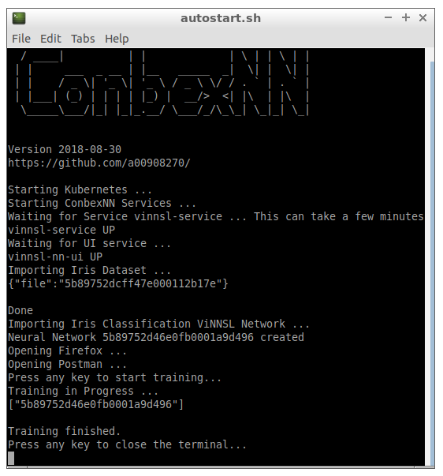
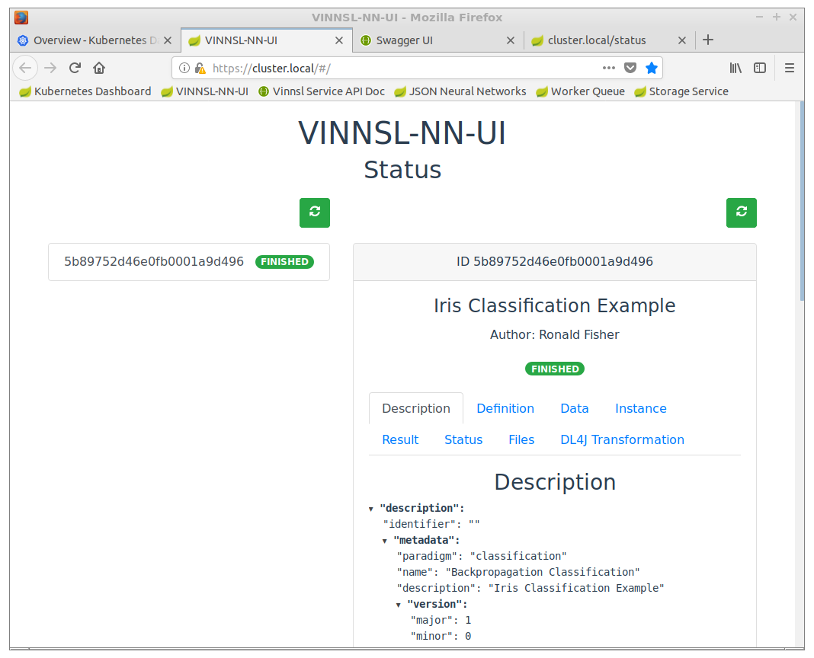
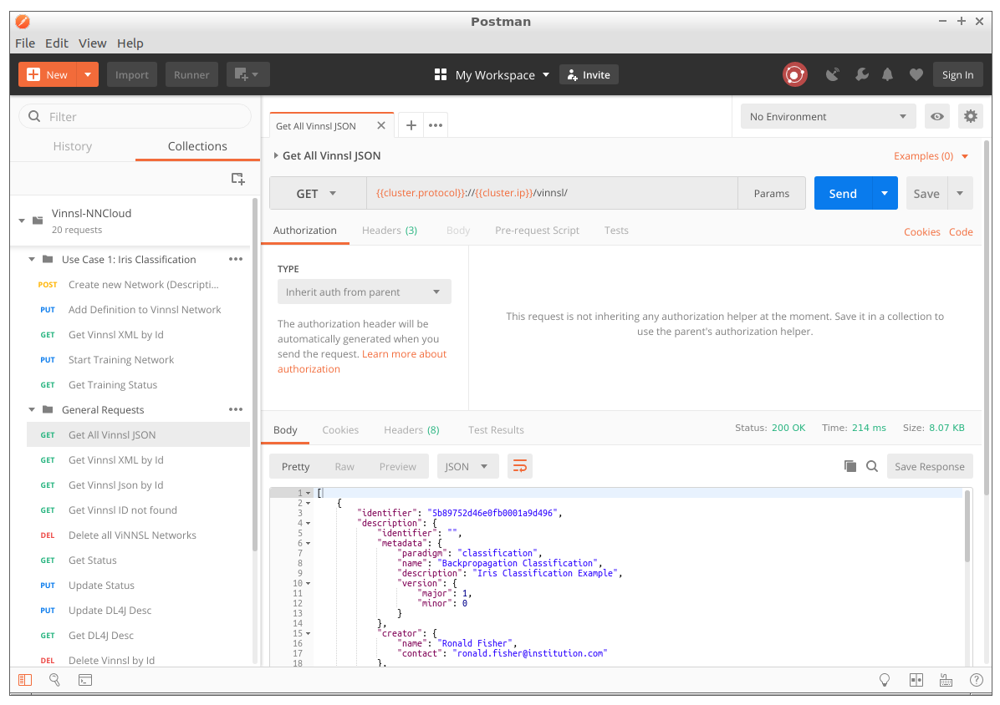

# Container Based Execution Stack for Neural Networks (ConbexNN)
This a project features web services to train and evaluate neural networks in the cloud using the Kubernetes container orchestration and a Java based microservice architecture. 

## Local Setup 

#### Setup with Kubernetes 1.18.2 and Docker 19.03.8 as container runtime

See [instructions here](deploy/local_kubernetes/README.md)

## Test scenario 
See [ConbexNN-test-scenario.txt](ConbexNN-test-scenario.txt)

## Demo VM

After Login the VM starts `autostart.sh` initalizing ConbexNN. The Iris testset and a ViNNSL neural network are automatically imported.

### Browser

Firefox is preinstalled and opens predefined Tabs

* Kubernetes Dashboard
* VINNSL-NN-UI (user interface showing imported neural networks)
* Swagger API (documentation of the ConbexNN RESTful interface)
* Status Tab (shows status of imported neural networks)

#### ConbexNN Endpoints

https://kubernetes.host + endpoint

| endpoint        | Service                           |
| --------------- | --------------------------------- |
| /#/             | Vinnsl NN UI                      |
| /vinnsl         | Vinnsl Service                    |
| /status         | Vinnsl NN Status                  |
| /worker/queue   | Worker Queue                      |
| /storage        | Storage Service                   |
| /train/overview | DL4J Training UI (while training) |

### Postman

Use [ConbexNNVM.postman_collection.json](ConbexNNVM.postman_collection.json)

