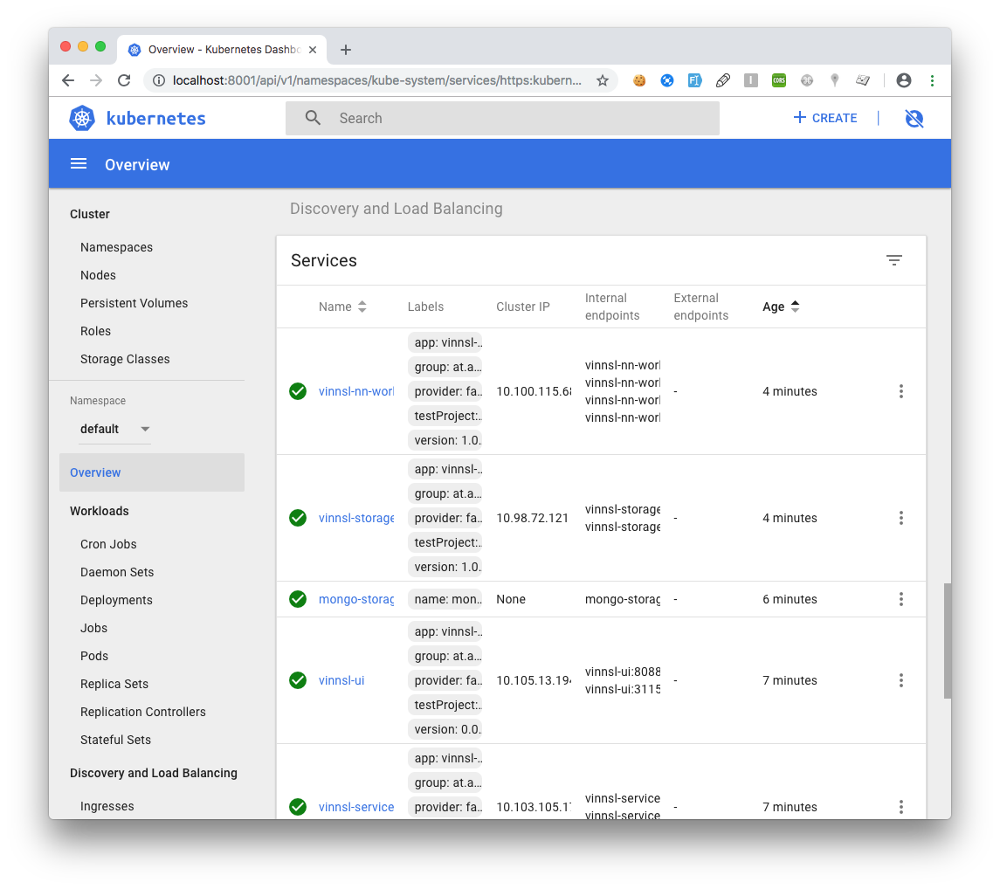

# Setting up on local Kubernetes 1.18.2 and Docker 19.03.8 as container runtime

## Prerequisites

- Installed Docker 19.03.8 or any other [container runtime](https://kubernetes.io/docs/setup/production-environment/container-runtimes/#docker)

- Installed kubeadm, kubelet, kubectl https://kubernetes.io/docs/setup/production-environment/tools/kubeadm/install-kubeadm

- Created a [cluster](https://kubernetes.io/docs/setup/production-environment/tools/kubeadm/create-cluster-kubeadm)

- Installed [Kubernetes Dashboard](https://github.com/kubernetes/dashboard#kubernetes-dashboard)

- Installed [NGINX Ingress controller](https://kubernetes.github.io/ingress-nginx/deploy/#docker-for-mac)

## Set up

### Setup Services

cd into folder `./deploy/local_kubernetes`

```bash
kubectl apply -f namespace_nsd.yaml
kubectl apply -f mongo_small.yaml
kubectl apply -f vinnsl-service.yaml
kubectl apply -f vinnsl-nn-ui.yaml
kubectl apply -f mongo-storage-service.yaml
kubectl apply -f vinnsl-storage-service.yaml
kubectl apply -f vinnsl-nn-worker.yaml
```

### Check if Services are up

Check services are in state Running on Kubernetes Dashboard or by command:

    kubectl get pods -n nsd

All Services should be deployed and ready



### Enable Service Discovery with Ingress

#### Install Ingress if not installed

Check Ingress installed

    kubectl get pods -n nginx-ingress
    kubectl get pods -n ingress-nginx
    kubectl get pods --all-namespaces | grep ingress

Install Ingress if not installed

```bash
kubectl apply -f https://raw.githubusercontent.com/kubernetes/ingress-nginx/controller-0.32.0/deploy/static/provider/cloud/deploy.yaml
```

#### Configure Ingress 

```
kubectl apply -f ingress.yaml
```

After a few minutes 

```
kubectl get ing
```

should return

```
NAME              HOSTS     ADDRESS     PORTS     AGE
cluster-ingress   *         localhost   80        2m
```

You can now open your browser: https://kubernetes.host/#/ and should see the Vinnsl-NN-UI

## Use ConbexNN

After successful setup should be able to open the following endpoints in your browser:

https://kubernetes.host + endpoint

| endpoint        | Service                           |
| --------------- | --------------------------------- |
| /#/             | Vinnsl NN UI                      |
| /vinnsl         | Vinnsl Service                    |
| /status         | Vinnsl NN Status                  |
| /worker/queue   | Worker Queue                      |
| /storage        | Storage Service                   |
| /train/overview | DL4J Training UI (while training) |

 
